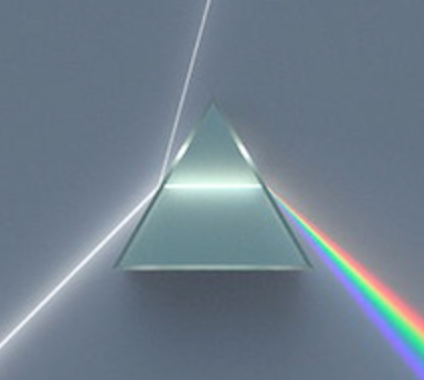
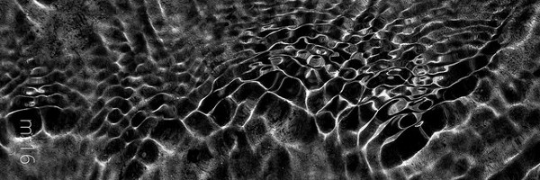

<!-- PROJECT LOGO -->
 

  

  <h3 align="center">Surface Plasmon Resonance Application</h3>

  

    Eventually, we're gonna have a really cool name and a really cool description
     
     
     
  

<!-- TABLE OF CONTENTS -->

  
Table of Contents

  <ol>
    <li>
      <a href="#about-the-project">About The Project</a>
      <ul>
        <li><a href="#built-with">Built With</a></li>
      </ul>
    </li>
    <li><a href="#contributors">Contributors</a></li>
    <li><a href="#license">License</a></li>
  </ol>

<!-- ABOUT THE PROJECT -->
## About The Project

 

This application is intended to be used with a custom design casing that houses a laser, several mirrors and lenses, a prism, (some other shit that I’m too lazy to figure out right now), a microcontroller unit with an embedded camera, and finally a power supply unit that uses either an internal battery or AC adaptor.

Here is a list of planned features for the software:
* Binary control of the laser diode to preform excitation
* Management of data capture rate and pixel density
* View battery life of the internal LiPo battery
* View, store, and manipulate captured data from current or past experiments
* There's gonan be some other stuff too, just you wait ... I just gotta think of them

I need coffee.

A list of commonly used resources such as plugins and addons that I found helpful are listed in the acknowledgements.

### Built With

* [Python](https://www.python.org/)
* [Kivy](https://kivy.org/#home)
* [Buildozer](https://buildozer.readthedocs.io/en/latest/)

<!-- CONTRI -->
## Contributors

Robert Ballentine, PSE  
Robin Howell, PSE  
James Henderson, CpE  

<!-- LICENSE -->
## License

Distributed under the MIT License. See `LICENSE` for more information.

<!-- MARKDOWN LINKS & IMAGES -->
<!-- https://www.markdownguide.org/basic-syntax/#reference-style-links -->
[contributors-shield]: https://img.shields.io/github/contributors/othneildrew/Best-README-Template.svg?style=for-the-badge
[linkedin-url]: https://linkedin.com/in/othneildrew
[product-screenshot]: images/screenshot.png
